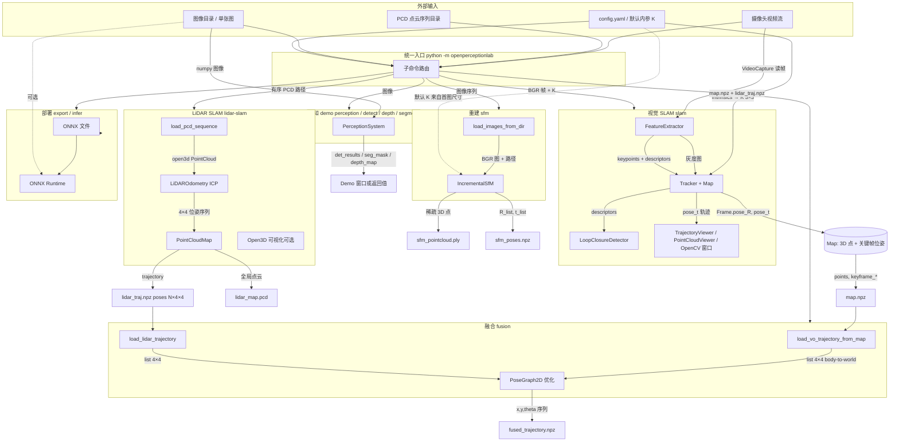

# OpenPerceptionLab 系统数据流图与说明

本文描述 **每条数据从哪来、经哪些处理、到哪去**，对应命令：`opl slam` / `opl lidar-slam` / `opl fusion` / `opl sfm` / `opl demo` / `opl export` / `opl infer`。

> **不是“纯文字”**：下面第 1 节里的 **` ```mermaid ` … ` ``` `** 代码块就是**矢量图的源代码**。默认 Markdown 预览往往只显示代码，需要 [第 4 节](#4-如何把-mermaid-转成清晰图推荐工具与方法) 里的工具才能**渲染**或**导出 PNG/SVG**。  
> 同一张图的可导出源文件：`diagrams/system_dataflow.mmd`。

---

## 1. 总览：系统级数据流（DFD 风格）

下图按 **数据源 → 处理过程 → 数据落盘/展示** 组织；边上标注 **数据载体/字段含义**。



---

## 2. 按流水线逐条说明数据怎么流动

### 2.1 视觉 SLAM（`opl slam`）

| 步骤 | 数据从哪来 | 处理 | 数据到哪去 |
|------|------------|------|------------|
| 1 | 摄像头 `cv2.VideoCapture(camera_index)` | 读一帧 | **BGR 图像** `img` |
| 2 | `img` | `cvtColor` → **灰度** `gray` | 构造 `Frame(gray, K, frame_id)` |
| 3 | `config.yaml` 或默认 | `IntrinsicsConfig.as_K()` | **内参矩阵 K**（3×3），写入 `Frame` 与 `Tracker` |
| 4 | `gray` | `FeatureExtractor.extract` | **关键点 `kp` + 描述子 `des`** 挂在 `Frame` 上 |
| 5 | `Frame` + 已有 `Map` | `Tracker.process` | 更新 **当前帧位姿** `pose_R`（3×3）、`pose_t`（3×1）；可选 **关键帧**、**三角化 3D 点** 写入 `Map.points` |
| 6 | 关键帧描述子 | `LoopClosureDetector` | **布尔 + 回环关键帧 id**（日志）；不直接改地图文件 |
| 7 | `map_.points`、`frame.pose_t` | `PointCloudViewer` / `TrajectoryViewer` | **Open3D / 可视化**（内存中展示） |
| 8 | 用户按 ESC 退出且指定 `--save-map` | `Map.save` | **`.npz`**：`points` (M×3)、`keyframe_ids`、`keyframe_R` (N×3×3)、`keyframe_t` (N×3) —— 供融合读 VO 轨迹 |

**数据形态小结**：视频流 → 逐帧灰度 + 特征 → 位姿链 + 稀疏地图点 → 可选持久化为 `map.npz`。

---

### 2.2 LiDAR SLAM（`opl lidar-slam`）

| 步骤 | 数据从哪来 | 处理 | 数据到哪去 |
|------|------------|------|------------|
| 1 | 目录下排序后的 `*.pcd` 路径列表 | `load_pcd` | **Open3D PointCloud**（每帧） |
| 2 | 点云 + `voxel_size` | 可选体素下采样 | 更小点云进入里程计 |
| 3 | 相邻帧点云 | `LiDAROdometry.process`（ICP） | **当前帧 4×4 位姿**（body-to-world），追加到 `PointCloudMap.trajectory` |
| 4 | 每帧点云 + 位姿 | `PointCloudMap.add_scan` | **全局坐标系下的累积地图**（内存） |
| 5 | `--show` | Open3D Visualizer | 实时显示全局点云 |
| 6 | 结束 | `save_pcd` | **`lidar_map.pcd`**：全局点云文件 |
| 7 | `--save-trajectory` | `np.savez_compressed(..., poses=)` | **`lidar_traj.npz`**：`poses` 形状 **(N, 4, 4)**，供融合使用 |

**数据形态小结**：离散 PCD 序列 → 帧间 ICP 位姿链 → 融合进全局地图 → 输出 PCD 地图 + 可选位姿 `npz`。

---

### 2.3 多传感器融合（`opl fusion`）

| 步骤 | 数据从哪来 | 处理 | 数据到哪去 |
|------|------------|------|------------|
| 1a | `map.npz`（视觉 SLAM 保存） | `load_vo_trajectory_from_map` 读 `keyframe_R`、`keyframe_t` | 转为 **list[N] of 4×4**（body-to-world） |
| 1b | `lidar_traj.npz` | `load_lidar_trajectory` 读 `poses` | **list[N] of 4×4** |
| 2 | 两条 4×4 序列 | `trajectories_to_2d` | 每条变为 **(x, y, θ)** 列表 |
| 3 | 2D 节点初值 + VO/LiDAR 相对约束 | `PoseGraph2D` 建图并 `optimize` | **融合后 2D 轨迹** list of (x,y,θ) |
| 4 | `--output` | `save_trajectory_2d` | **`fused_trajectory.npz`**：`x`、`y`、`theta` 三个一维数组 |

**注意**：真实数据路径要求两条轨迹 **时间/索引对齐**（实现里取 `min(len(vo), len(lidar))`）。`--demo` 则在内存生成合成 4×4 轨迹，不读文件。

---

### 2.4 增量式 SfM（`opl sfm`）

| 步骤 | 数据从哪来 | 处理 | 数据到哪去 |
|------|------------|------|------------|
| 1 | 图像目录 + glob | `load_images_from_dir` | **(path, BGR 图) 列表** |
| 2 | 第一张图尺寸 | `default_intrinsics_from_image` | **默认 K**（若未单独标定） |
| 3 | 前两帧图像 | `IncrementalSfM.add_first_two_views` | 初始化 **两相机位姿 + 初始 3D 点** |
| 4 | 后续每帧 | `add_view` | 增量加入 **相机位姿 + 三角化点** |
| 5 | 内部状态 | `get_points_array` | **稀疏 3D 点** N×3 |
| 6 | `--output` | `save_ply` | **`.ply`** 点云文件 |
| 7 | `--poses` | `save_poses_npz(R_list, t_list)` | **`.npz`** 相机姿态序列（与 `reconstruction/io.py` 中定义一致） |

---

### 2.5 感知 Demo（`opl demo perception` 等）

| 步骤 | 数据从哪来 | 处理 | 数据到哪去 |
|------|------------|------|------------|
| 1 | 单张图路径或默认图 / 摄像头 | 读入 **BGR 或 RGB 数组** | `PerceptionSystem.run(image)` |
| 2 | 同一张图 | YOLO | **det_results**（检测框等） |
| 3 | 同一张图 | DeepLabSegmenter | **seg_mask**（分割掩码） |
| 4 | 同一张图 | MiDaSDepth | **depth_map**（深度图） |

三路并行，**无强制下游**；Demo 脚本负责显示或打印。

---

### 2.6 部署（`opl export` / `opl infer`）

| 步骤 | 数据从哪来 | 处理 | 数据到哪去 |
|------|------------|------|------------|
| export | 代码内 tiny 网络或 MiDaS | 导出 | **`.onnx` 模型文件** |
| infer | ONNX 路径 + 可选 `--image` | ONNX Runtime `run` | **输出张量**（例如深度或分类 logits），由 `main_infer` 演示打印/简单后处理 |

---

## 3. 跨模块“文件级”数据契约（方便你对照代码）

| 文件 | 写入方 | 读取方 | 关键字段 |
|------|--------|--------|----------|
| `map.npz` | `slam/backend/map.py` `Map.save` | `fusion/io.py` `load_vo_trajectory_from_map` | `points`, `keyframe_ids`, `keyframe_R`, `keyframe_t` |
| `lidar_traj.npz` | `lidar/run_lidar_slam.py` | `fusion/io.py` `load_lidar_trajectory` | `poses` → (N,4,4) |
| `fused_trajectory.npz` | `fusion/io.py` `save_trajectory_2d` | 外部分析/可视化 | `x`, `y`, `theta` |
| `*.pcd` | LiDAR SLAM | CloudCompare 等 | 全局点云 |
| `*.ply` | SfM | MeshLab 等 | 稀疏点 |
| `config.yaml` | 用户 | `openperceptionlab.config.load_config` → `opl slam --config` | `camera`, `intrinsics`, `viewer`, `slam` |

---

## 4. 如何把 Mermaid 转成清晰图（推荐工具与方法）

Mermaid 是「用文本描述流程图」的格式。任选一种方式即可得到**清晰大图**（PNG/SVG）或在编辑器里**直接看图**。

### 4.1 在线（最快，无需安装）

1. 打开 **[Mermaid Live Editor](https://mermaid.live)**。
2. 把本文件 **第 1 节** 里 ` ```mermaid ` 与 ` ``` ` **之间的内容**（不含这两行）全部复制到左侧编辑区。
3. 右侧即时预览；菜单 **Actions → PNG / SVG** 即可下载。

（也可只打开仓库里的 `docs/diagrams/system_dataflow.mmd`，全选复制进去。）

### 4.2 Cursor / VS Code 里直接预览 Markdown

1. 扩展市场搜索并安装 **Markdown Preview Mermaid Support**（或 **Mermaid Markdown Syntax Highlighting** + 支持 Mermaid 的预览扩展）。
2. 打开本 `DATAFLOW.md`，使用 **Markdown 预览**（Cursor：`Ctrl+Shift+V` 或侧栏预览）。
3. 图中文字较多时，可在 Mermaid Live 里导出 **SVG**，用浏览器或 Inkscape 再放大查看。

### 4.3 命令行导出 PNG / SVG（适合放进 PPT / 文档）

需已安装 **[Node.js](https://nodejs.org/)**（自带 `npx`）。在**项目根目录**或 `docs/diagrams` 下执行：

```powershell
cd docs\diagrams
npx --yes @mermaid-js/mermaid-cli -i system_dataflow.mmd -o system_dataflow.svg
npx --yes @mermaid-js/mermaid-cli -i system_dataflow.mmd -o system_dataflow.png -w 2400 -H 1800
```

- **SVG**：无限缩放，适合论文/网页。  
- **PNG**：`-w` / `-H` 控制宽高（像素），图太大时可再调大。  
首次运行会下载 `@mermaid-js/mermaid-cli`（内含无头 Chrome），稍等即可。

### 4.4 Git / GitHub / GitLab

把仓库推到 **GitHub** 或 **GitLab** 后，在网页上打开 `DATAFLOW.md`，多数情况下会**自动渲染** ` ```mermaid ` 代码块。

### 4.5 其他常见工具

| 工具 | 说明 |
|------|------|
| **Obsidian** | 原生支持 Mermaid，笔记里直接出图。 |
| **Typora** | 偏好设置中开启 Mermaid，预览即渲染。 |
| **Notion** | 部分环境支持 `/code` 选 Mermaid（视工作区而定）。 |
| **Draw.io / diagrams.net** | 不读 Mermaid 时需**手动画**；适合要精细排版时。 |
| **PlantUML** | 另一套「文本出图」语法，与本项目文档无关，仅作替代方案。 |

---

*文档版本与仓库 **OpenPerceptionLab release 0.3.0** 代码一致。*
